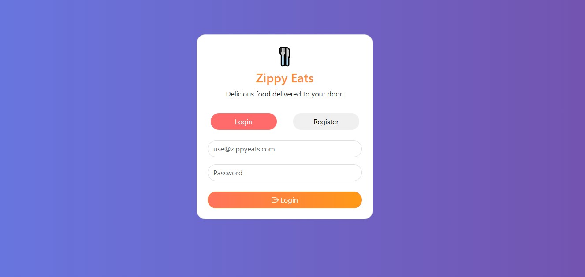
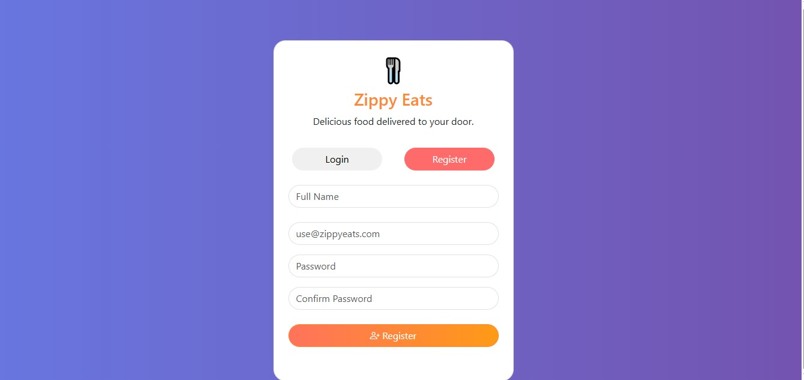
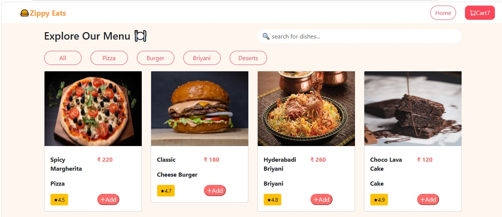
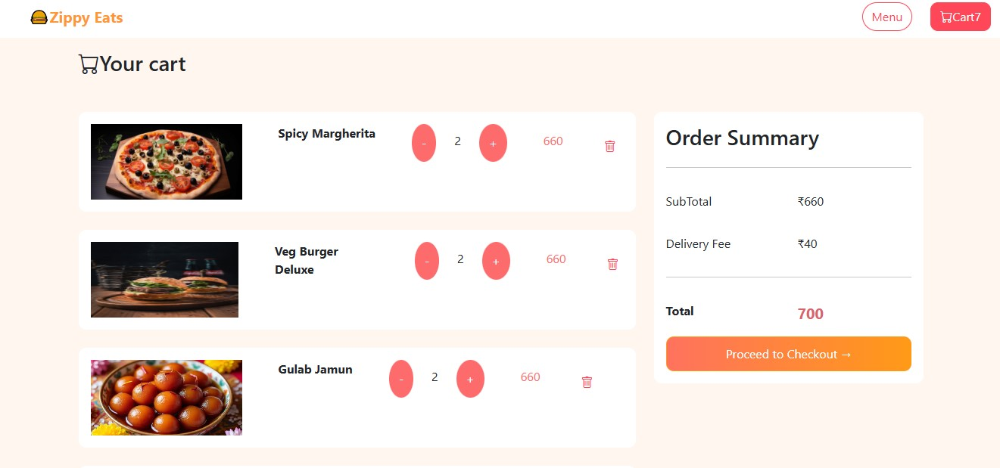
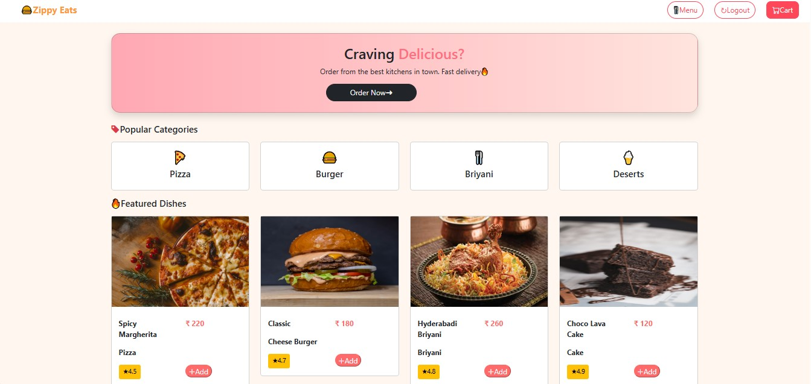

# 🍔 Zippy Eats

## 📖 Project Overview

Zippy Eats is a Java Full Stack food ordering web application that allows users to browse food items, add them to the cart, place orders, and manage their accounts. The application provides a simple and responsive interface for customers and an admin panel to manage restaurants, menu items, and orders.

## ✨ Features

- User Registration & Login
- Browse Food Menu
- Search Food Items
- Add to Cart
- Place Orders
- Order History
- Admin Dashboard
- Restaurant & Menu Management
- Responsive User Interface

## 🛠 Technologies Used

### Frontend
- HTML
- CSS
- JavaScript
- Bootstrap

### Backend
- Java
- Spring Boot
- Spring MVC
- Spring Data JPA

### Database
- MySQL

## 📂 Project Structure

ZippyEats/
├── frontend/
├── backend/
├── database/
├── screenshots/
└── README.md

## 📸 Screenshots

### Login Page

### Sign Up Page

### Home Page

### Menu Page

### Cart Page

### Checkout Page

### Admin Dashboard

## 👩‍💻 Author

**Theerthana Velusamy**

Java Full Stack Developer
